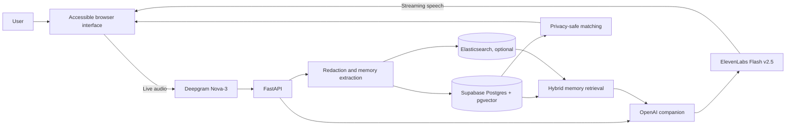

# RSpace

A voice-first AI companion that listens, remembers, and helps people build meaningful connections.

## Overview

RSpace turns natural conversation into a respectful, personalized experience. It combines real-time speech, private long-term memory, conversational continuity, and interest-based matching in a simple interface designed for clarity and ease of use.

## Architecture



## Features

- Continuous voice conversations with live listening, thinking, and speaking states
- Streaming Deepgram transcription and ElevenLabs speech generation
- Calm, concise responses that avoid patronizing elderspeak
- AI-extracted memories grounded in supporting conversation quotes
- PII redaction, confidence validation, and duplicate filtering
- 384-dimensional semantic memory with BM25, cosine similarity, and MMR retrieval
- Life Space for important people, dates, interests, and plans
- Conversation history and time-aware follow-ups across sessions
- Privacy-safe interest matching with mutual acceptance before email sharing
- Supabase authentication with HTTP-only session cookies
- Safety detection for explicit self-harm, abuse, and medical-emergency language
- Elasticsearch retrieval with automatic pgvector fallback

## Interface

### Talk

Start once and speak naturally. RSpace listens continuously, responds aloud, and remembers relevant context.

### Life Space

Review important people, dates, interests, and plans gathered from conversations.

### Connections

Discover people with shared interests, understand why you matched, and connect after mutual acceptance.

## Tech stack

| Layer | Technologies |
| --- | --- |
| Frontend | HTML, CSS, JavaScript, Web Audio API |
| Backend | Python, FastAPI, HTTPX, WebSockets |
| Voice | Deepgram Nova-3, ElevenLabs Flash v2.5 |
| AI | OpenAI Responses API, OpenAI embeddings |
| Data | Supabase Postgres, pgvector, Elasticsearch |
| Authentication | Supabase Auth, HTTP-only cookies |
| Deployment | Vercel |
| Testing | Python `unittest` |

## Run locally

Requires Python 3.11 or newer.

```bash
git clone https://github.com/Chadha-Bhavya/RSpace.git
cd RSpace
python3 -m venv .venv
source .venv/bin/activate
pip install -r requirements.txt
cp .env.example .env
```

Add your API credentials to `.env`, then start the app:

```bash
uvicorn main:app --reload
```

Open [http://127.0.0.1:8000](http://127.0.0.1:8000).

## API

| Method | Route | Purpose |
| --- | --- | --- |
| `POST` | `/api/auth/signup` | Create an account |
| `POST` | `/api/auth/login` | Start an authenticated session |
| `WS` | `/ws/respond` | Stream transcription, AI response, and speech |
| `GET` | `/api/life-space` | Load saved personal context |
| `GET` | `/api/matches` | Find relevant connections |
| `GET` | `/api/connections` | List mutually accepted connections |


